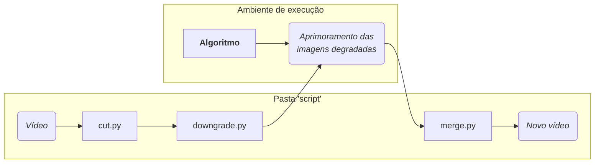
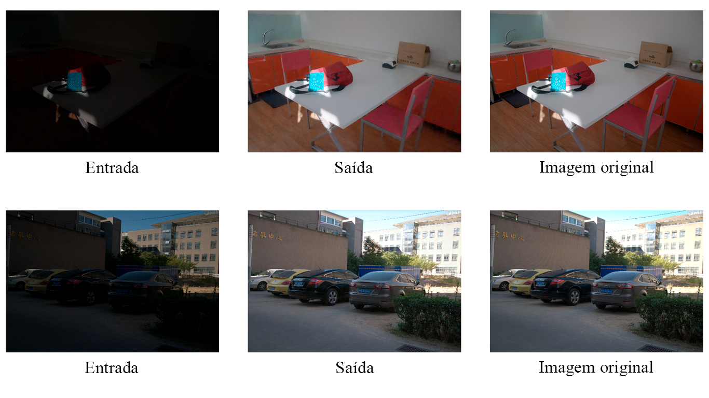

# Visão geral
## Conteúdo do repositório
A pasta "script" possui outras sub-pastas e três códigos curtos. O conteúdo todo tem o objetivo de recortar os frames de um vídeo em imagens que serão degradadas (com desfoque, baixa resolução e ruído) para então serem aprimoradas pelas redes neurais selecionadas. Depois do aprimoramento de cada frame alterado, essas imagens serão mescladas novamente para formar um novo vídeo mais próximo o possível do vídeo original. Desse modo será possível comparar o quão próximo o aprimoramento dos algoritmos consegue chegar do vídeo não alterado.

<div align="center">

  ### Esquematização[^1]

</div>



Já a pasta "imagens" terá uma série de comparações feitas com os algoritmos de aprimoramento de imagens que estão vinculados na próxima seção. Essas comparações serão dadas como o exemplo abaixo da aplicação de uma rede neural de aprimoramento de imagem de baixo nível de luz.



Por fim, em "métricas" haverão as implementações em Python de cálculos para avaliar a precisão das imagens geradas com suas versões originais, também vinculadas na seção seguinte.

## Documentação (hyperlinks)
### Algoritmos
- ```🏷️ principal``` **MIRNet-v2**: [Artigo](https://arxiv.org/pdf/2205.01649v1) | [Código](https://github.com/swz30/MIRNetv2)
- **IFAN**: [Artigo](https://arxiv.org/pdf/2108.13610v2) | [Código](https://github.com/codeslake/IFAN)
- **SwinIR**: [Artigo](https://arxiv.org/pdf/2108.10257v1) | [Código](https://github.com/jingyunliang/swinir)
- **BSRGAN**: [Artigo](https://arxiv.org/pdf/2103.14006) | [Código](https://github.com/cszn/BSRGAN)
- **Real-ESRGAN**: [Artigo](https://arxiv.org/pdf/2107.10833) | [Código](https://github.com/ai-forever/Real-ESRGAN)
- **SCUNet**: [Artigo](https://arxiv.org/pdf/2203.13278) | [Código](https://github.com/cszn/SCUNet)
- **NAFNet**: [Artigo](https://arxiv.org/pdf/2204.04676) | [Código](https://github.com/megvii-research/NAFNet)
- **MAXIM**: [Artigo](https://arxiv.org/pdf/2201.02973) | [Código](https://github.com/google-research/maxim)
- **HWMNet**: [Artigo](https://arxiv.org/pdf/2203.01296) | [Código](https://github.com/fanchimao/hwmnet)
- **Bread**: [Artigo](https://arxiv.org/pdf/2111.15557) | [Código](https://github.com/mingcv/bread)
- **Unsupervised Night Image Enhancement (UNIE)**: [Artigo](https://arxiv.org/pdf/2207.10564) | [Código](https://github.com/jinyeying/night-enhancement)

### Métricas da precisão das imagens
| Métrica | Implementação |
| ----------- | ----------- |
| Distância de Hausdorff | [Fast computation of Hausdorff distance in Python](https://github.com/mavillan/py-hausdorff/tree/master)<br>[Weighted Hausdorff Distance](https://github.com/HaipengXiong/weighted-hausdorff-loss/tree/master) |
| RMSE | [RSME](https://github.com/wangmengsd/RSME/tree/main) |
| SNR | [SNR-aware low-light image enhancement](https://github.com/dvlab-research/SNR-Aware-Low-Light-Enhance) |
| PSNR | [Video Quality Metrics](https://github.com/aizvorski/video-quality/tree/master) |
| SSIM | [Video Quality Metrics](https://github.com/aizvorski/video-quality/tree/master) | 

### Datasets
- Para **correção de desfoque**:
	- [DPDD](https://github.com/Abdullah-Abuolaim/defocus-deblurring-dual-pixel)
- Para **correção de baixa resolução**:
	- [DRealSR](https://drive.google.com/drive/folders/1tP5m4k1_shFT6Dcw31XV8cWHtblGmbOk)
- Para **correção de ruído**:
	- [Color BSD68](https://github.com/clausmichele/CBSD68-dataset)
- Para **correção de baixo nível de luz**:
	- [LOL](https://drive.google.com/file/d/157bjO1_cFuSd0HWDUuAmcHRJDVyWpOxB/view)
	- [DARK FACE](https://flyywh.github.io/CVPRW2019LowLight/)
- Outros:
	- [Vision-based Fight Detection From Surveillance Cameras Dataset](https://github.com/seymanurakti/fight-detection-surv-dataset/tree/master)
	- [VIRAT Video Data](https://viratdata.org/)
	- [Tiny-VIRAT](https://github.com/vyzuer/Tiny-VIRAT)

## Objetivo principal
Avaliar o desempenho do algoritmo [**MIRNet-v2**](#algoritmos) comparando-o com outras técnicas de aprimoramento não utilizadas para experimentação na sua publicação original e que tiveram uma data de lançamento próxima ao algoritmo escolhido (até 2022).
O motivo para não escolher um algoritmo mais recente, como algum publicado em 2023, são os resultados da revisão sistemática da literatura realizada sobre essa área de estudo. Dentre os avaliados, o MIRNet-v2 permaneceu sendo a rede neural mais robusta, bem apresentada e acessível, favorecendo sua escolha. Como esse método realiza quatro tarefas de aprimoramento de imagem diferentes, serão feitas comparações entre estas tarefas e outros algoritmos de mesma proposta.
- [x] Para a tarefa de **correção de desfoque**, comparar MIRNet-v2 com IFAN
- [x] Para a tarefa de **correção de baixa resolução**, comparar MIRNet-v2 com SwinIR, BSRGAN e Real-ESRGAN
- [x] Para a tarefa de **correção de ruído**, comparar MIRNet-v2 com SCUNet, NAFNet e MAXIM
- [x] Para a tarefa de **correção de baixo nível de luz**, comparar MIRNet-v2 com HWMNet, Bread e IAT

[^1]: Algoritmos utilizados para o aprimoramento das imagens/vídeos não estão nesse repositório
